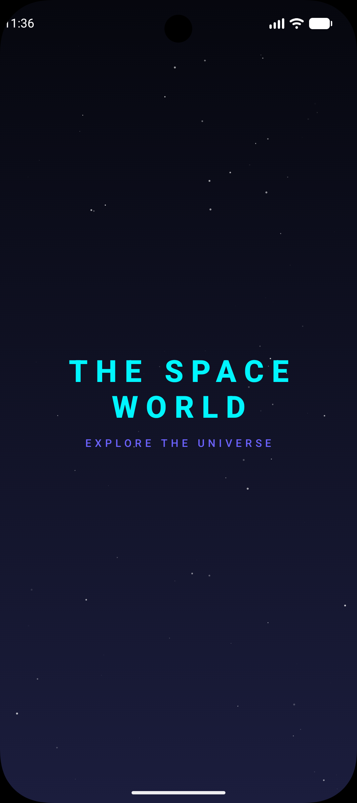
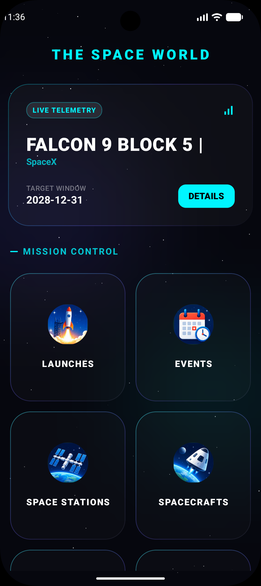
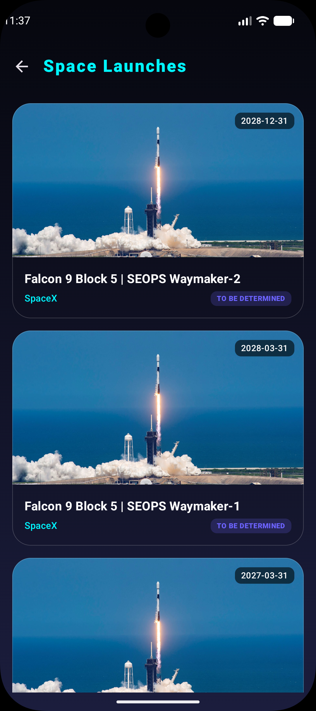
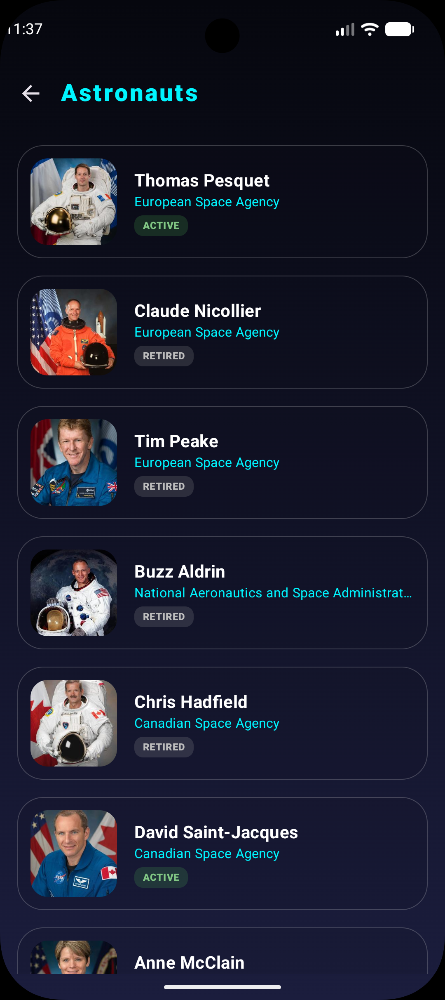
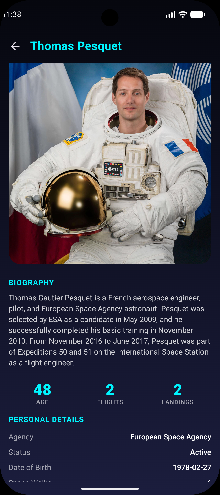

# The Space World

A modern, high-performance **Kotlin Multiplatform (KMP)** application for exploring space activities, launches, and celestial events. Built with **Compose Multiplatform**, targeting Android, iOS, and Desktop (JVM).

## 🚀 Key Features

- **Space Launches**: Real-time tracking of upcoming and past missions using The Space Devs API.
- **Hero Countdown**: Dynamic "Next Launch" hero section on the home screen with direct navigation to details.
- **Glassmorphic UI**: Immersive, modern space-themed design with grid-based navigation and realistic icons.
- **Offline First**: Full local persistence using **Room Database** for seamless usage without internet.
- **Unified Logic**: Shared networking, database, business logic, and UI code across all platforms.

---

## 📸 Screenshots & Working Demo

### 🎥 App Demo
<div align="center">
  <video src="screenshots/Screen_recording_20260822_115129.webm" width="80%" controls>
    Your browser does not support the video tag.
  </video>
</div>

### Android
<div align="center">
  
  
  
</div>
<br/>
<div align="center">
  
  
  
</div>

### iOS
<div align="center">
  
  
  
</div>
<br/>
<div align="center">
  
  
  
</div>

### Desktop
<div align="center">
  
  
</div>
<br/>
<div align="center">
  
  
</div>

---

## 🏗️ Architecture & Patterns

The project is built using a strict **Clean Architecture** approach combined with **Unidirectional Data Flow (UDF)**.

### 1. Multi-Layered Clean Architecture
- **Presentation Layer (`shared/presentation`)**: 
  - **Compose Multiplatform**: Declarative UI shared across Android, iOS, and Desktop.
  - **ViewModels**: Powered by Koin, managing screen state and processing user actions.
- **Domain Layer (`shared/domain`)**:
  - **Models**: Platform-agnostic data structures.
  - **Use Cases**: Encapsulated business logic (e.g., `GetLaunchesUseCase`).
  - **Repositories (Interfaces)**: Defines data contracts for the data layer.
- **Data Layer (`shared/data`)**:
  - **Remote**: Ktor implementation of network requests.
  - **Local**: Room implementation for local storage.
  - **Mappers**: Logic to convert DTOs (API) and Entities (DB) into Domain models.

### 2. Unidirectional Data Flow (UDF)
Each screen uses a consistent state management pattern:
- **State**: A single `StateFlow` (e.g., `LaunchesUiState`) that represents the entire UI state.
- **Actions**: A sealed interface (e.g., `LaunchesAction`) for all user interactions.
- **Flow**: UI sends **Actions** -> ViewModel updates **State** -> UI observes and re-renders.

---

## 🛠️ Technology Stack

| Feature | Library |
| :--- | :--- |
| **Language** | Kotlin (100%) |
| **UI Framework** | Compose Multiplatform (Material 3) |
| **Navigation** | Jetpack Compose Navigation (Type-Safe) |
| **Dependency Injection** | Koin |
| **Networking** | Ktor (OkHttp for Android/JVM, Darwin for iOS) |
| **Local Database** | Room (KMP) |
| **Image Loading** | Coil 3 (KMP) |
| **Serialization** | Kotlinx Serialization (JSON) |
| **Asynchronous** | Coroutines & Flow |

---

## 🧭 Type-Safe Navigation

The project utilizes the new **Type-Safe Navigation** for Compose Multiplatform. Screens are defined as `@Serializable` objects or data classes.

```kotlin
sealed interface Screen {
    @Serializable data object Home : Screen
    @Serializable data class LaunchDetail(val id: String) : Screen
    // ...
}
```

This ensures compile-time safety when navigating between screens and passing arguments.

---

## 💉 Dependency Injection (Koin)

Koin is used for dependency injection across all platforms, ensuring a clean and testable codebase.

- **Modular Design**: Separated modules for `Network`, `Data`, `UseCase`, `ViewModel`, and `Platform`.
- **Platform Specifics**: `PlatformModule` handles platform-specific implementations like `DatabaseBuilder` and `HttpClientEngine`.
- **Initialization**: Centralized `initKoin` function called from `MainActivity` (Android), `MainViewController` (iOS), and `main.kt` (Desktop).

---

## 📡 Networking Handling

We use **Ktor** with a robust `safeCall` wrapper to handle network requests and errors consistently.

- **Centralized Config**: `HttpClient` is configured in `NetworkModule.kt` with Content Negotiation and Logging.
- **Error Handling**: Custom `Result` and `NetworkError` classes to map HTTP errors (401, 404, 500, etc.) to typed domain errors.
- **Platform Specifics**: Injected `HttpClientEngine` via Koin (`OkHttp` for Android/JVM, `Darwin` for iOS).

---

## 💾 Database (Room KMP)

Persistence is handled by **Room**, which is now available for Kotlin Multiplatform.

- **Local Source of Truth**: The app follows a "Network Bound Resource" pattern where UI always observes the local database.
- **DAO Pattern**: Clean interfaces for database operations (`LaunchDao`, `AgencyDao`, etc.).
- **Platform Builders**: `DatabaseBuilder` uses `expect/actual` to handle file paths differently on Android, iOS, and JVM.

---

## 📂 Project Structure

```text
├── androidApp          # Android application entry point
├── iosApp              # iOS Swift project (Xcode)
├── desktopApp          # Desktop JVM entry point
├── gradle              # Dependency management (libs.versions.toml)
└── shared              # Shared KMP module
    ├── commonMain      # Core shared logic (UI, Domain, Data)
    │   ├── kotlin      # Shared Kotlin code
    │   └── composeRes  # Shared resources (SVG icons, Strings)
    ├── androidMain     # Android specific DI and platform logic
    ├── iosMain         # iOS specific DI and MainViewController
    └── jvmMain         # Desktop specific DI and Database configuration
```

---

## 🏁 Getting Started

### Prerequisites
- **Android Studio** (Latest version recommended)
- **Xcode** (For iOS target)
- **JDK 17+**

### Building and Running
1. **Android**: Select `androidApp` configuration and press Run.
2. **Desktop**: 
   - Standard: `./gradlew :desktopApp:run`
   - Hot Reload: `./gradlew :desktopApp:hotRun --auto`
3. **iOS**: 
   - Open `iosApp/iosApp.xcworkspace` in Xcode.
   - Run the app on a simulator or device.

---

## 📝 Recent Updates
- ✅ Added realistic space icons in SVG format to common resources.
- ✅ Fixed Ktor engine implementation errors for Desktop.
- ✅ Implemented dynamic Hero section with direct navigation to launch details.
- ✅ Enhanced UI with modern glassmorphism design.

---

## 🤝 Credits & Acknowledgements

- **Data Source**: This project uses [The Space Devs API](https://thespacedevs.com/) for fetching all space-related data. Special thanks to the TSD team for providing such a comprehensive and free API.

Learn more about [Kotlin Multiplatform](https://www.jetbrains.com/help/kotlin-multiplatform-dev/get-started.html).
